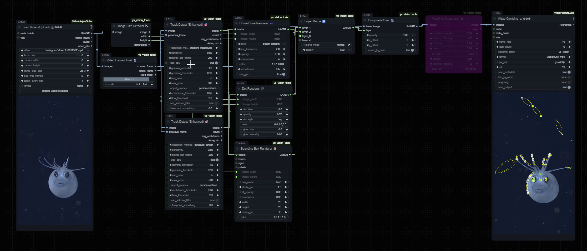

# YS-vision-tools

Advanced ComfyUI custom nodes for GPU-accelerated vision overlays with experimental mathematical curves and smart detection methods.


## Overview

A visual effects system for ComfyUI providing GPU-accelerated point tracking and mathematical curve rendering. Designed for RTX 5090 performance targets (4K @ 60fps).

**Core capabilities:**
- Track points using gradient, optical flow, phase congruency, structure tensor, saliency, YOLO, or hybrid methods
- Render connections with 15+ curve types (Bézier, spirals, field lines, Fourier series, elastic curves)
- Apply 10+ line styles (solid, electric, pulsing, particle trails, wave modulation)
- Compose layers with blend modes and alpha compositing



## Installation

```bash
cd ComfyUI/custom_nodes/
git clone https://github.com/yamb0x/comfyui-ys-vision-tools.git
cd comfyui-ys-vision-tools
pip install -r requirements.txt
```

**GPU acceleration (recommended):**
```bash
pip install cupy-cuda12x
pip install torch torchvision --index-url https://download.pytorch.org/whl/cu121
pip install ultralytics  # for YOLO detection
```

Restart ComfyUI after installation.

## Available Nodes

### Track Detect (Enhanced)
Detects and tracks points using configurable methods.

**Inputs:** Image, detection method, sensitivity, max points, area filter  
**Outputs:** Track coordinates, count, confidence, debug visualization  
**Methods:** gradient_magnitude, phase_congruency, structure_tensor, optical_flow, saliency_map, object_detection, hybrid_adaptive

GPU-accelerated with Kalman filtering and area-based filtering.

### Line Link Renderer (Advanced)
Renders mathematical curves connecting tracked points.

**Inputs:** Tracks, dimensions, curve type, line style, parameters  
**Outputs:** RGBA layer  
**Curve types:** straight, bezier_quadratic, bezier_cubic, catmull_rom, logarithmic_spiral, elastic_curve, fourier_series, field_line, gravitational_path, voronoi_edges, delaunay_triangulation, minimum_spanning_tree, neural_flow_field  
**Line styles:** solid, dotted, dashed, dash_dot, gradient_fade, pulsing, electric, lightning, particle_trail, wave_modulation

### Dot Renderer
Renders tracked points as styled markers.

**Inputs:** Tracks, dimensions, size, style, glow  
**Outputs:** RGBA layer  
**Styles:** solid, ring, cross, plus, square, diamond

### Palette Map
Generates color palettes for visualization.

**Inputs:** Palette type, color count  
**Outputs:** Palette data  
**Types:** rainbow, viridis, plasma, inferno, magma, cool, warm, custom

### Layer Merge
Composites multiple RGBA layers.

**Inputs:** 2-4 layers, blend mode, opacity  
**Outputs:** Merged layer  
**Modes:** normal, add, multiply, screen, overlay, max, min

### Composite Over
Alpha-composites layer onto base image.

**Inputs:** Base image, layer, opacity, offset  
**Outputs:** Composited image

## Example Workflow

**Typical configuration:**
- Detection: `gradient_magnitude` at 0.6 sensitivity, 500 points
- Curves: `logarithmic_spiral` with `electric` style
- Dots: `ring` style with 8.0 glow
- Blend: `add` mode

## Performance

Benchmarks on RTX 5090 with GPU acceleration:

| Resolution | Detection | Curves | Render | Total  | Target FPS |
|------------|-----------|--------|--------|--------|------------|
| 1080p      | <5ms      | <2ms   | <3ms   | <10ms  | 100+       |
| 4K         | <10ms     | <5ms   | <8ms   | <23ms  | 60         |
| 8K         | <25ms     | <10ms  | <20ms  | <55ms  | 18+        |

## Detection Method Guide

**gradient_magnitude** - Edge detection via Sobel/Scharr operators. Fast, works on high-texture images.  
**phase_congruency** - Frequency-domain features. Lighting-invariant, good for patterns.  
**structure_tensor** - Corner detection. Identifies keypoints and junctions.  
**optical_flow** - Motion tracking between frames. Requires sequential input.  
**saliency_map** - Visual attention modeling. Highlights perceptually salient regions.  
**object_detection** - YOLO-based semantic detection. Tracks specific object classes.  
**hybrid_adaptive** - Combines multiple methods. Best overall accuracy, higher compute cost.

## Curve Type Reference

**straight** - Direct point-to-point connections  
**bezier_quadratic/cubic** - Smooth controllable curves  
**catmull_rom** - Interpolating spline through all points  
**logarithmic_spiral** - Natural spiral growth pattern  
**elastic_curve** - Spring-like bouncing paths  
**fourier_series** - Harmonic wave compositions  
**field_line** - Magnetic field visualization  
**gravitational_path** - Physics-based drooping curves  
**voronoi_edges/delaunay_triangulation** - Graph-based spatial partitioning  
**neural_flow_field** - ML-guided flow patterns

## Development

```bash
# Unit tests
pytest tests/unit/

# Visual regression tests
python tests/visual/generate_references.py
python tests/visual/compare_outputs.py

# GPU benchmarks
python tests/performance/benchmark_gpu.py
```

**Project status:**
- Phase 1 (complete): Core tracking and curve rendering
- Phase 2 (in progress): Extended renderers (bbox, blur, HUD, MV-look)
- Phase 3 (planned): Optimization passes
- Phase 4 (planned): Neural-guided features

## Technical Notes

GPU memory automatically configured for 8GB per operation (safe limit for 24GB VRAM). PyTorch uses 80% available memory. TensorFloat32 enabled by default.

All curve implementations use proper mathematical equations, not approximations. Rendering uses anti-aliased line drawing with sub-pixel accuracy.

## License

MIT License - see LICENSE file

## Credits

Developed by Yambo Studio for ComfyUI  
Optimized for NVIDIA RTX 5090

---

**Support:** [GitHub Issues](https://github.com/yamb0x/comfyui-ys-vision-tools/issues) | **Documentation:** [docs/plans/](docs/plans/)